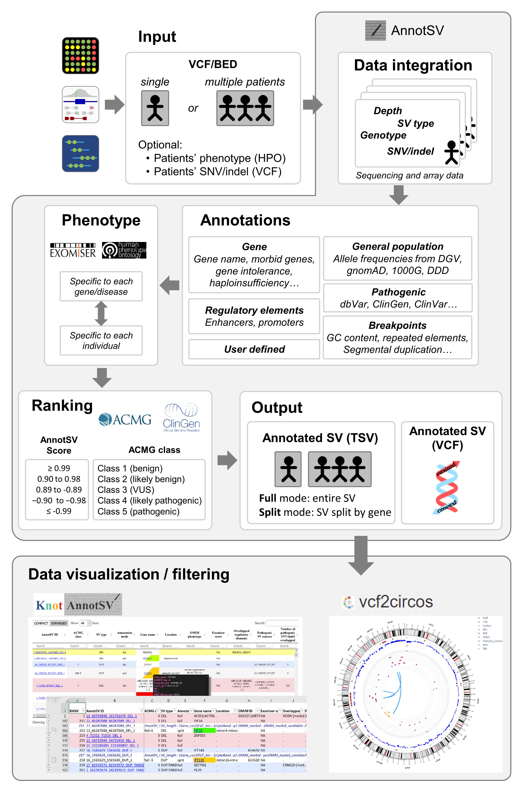

# Aim
**AnnotSV is a standalone program designed for annotating and ranking Structural Variations (SV).** This tool is implemented in Tcl, with a ready to start installation, and run in command line on all platforms.

The AnnotSV stand-alone program is available for download in the [Downloads](downloads.md) tab.
Also, to run AnnotSV online, a user-friendly web server interface is available on the main page of the [webserver](https://lbgi.fr/AnnotSV/).

AnnotSV compiles functionally, regulatory and clinically **relevant information** and aims at providing annotations useful to i) **interpret SV potential pathogenicity and ii) filter out SV potential false positives.**

Different types of SV exist including deletions, duplications, insertions, inversions, translocations or rearrangements that are more complex. They can be either balanced or unbalanced. When unbalanced and resulting in a gain or loss of material, they are called Copy Number Variations (CNV). CNV can be described by coordinates on one chromosome, with the start and end positions of the SV (deletions, insertions, duplications). Complex rearrangements with breakends can arbitrary be summarized as a set of novel adjacencies, as described in the Variant Call Format specification [VCFv4.3](https://samtools.github.io/hts-specs/VCFv4.3.pdf) (May 2020).

AnnotSV takes as an input file a classical VCF or BED file describing the SV type and coordinates. The output file contains the overlaps of the SV with relevant genomic features where the genes refer to RefSeq or ENSEMBL genes (user defined).

 

 

AnnotSV provides numerous **relevant annotations** that are detailed [here](annotations.md).

In addition, AnnotSV provides on top of the annotations **a ranking score** to assess SV pathogenicity.
This score is an adaptation of the work provided by the joint consensus recommendation of ACMG and ClinGen (Riggs et al., 2020). We especially took attention in scoring as much as possible recessive SV observed in various dataset (NGS, array based...)

**The SV classification is detailed [here](ranking.md).**

This program is well detailed in the README file.
Thank you for taking the time to use AnnotSV, your feedback is greatly appreciated.

 

# Input

AnnotSV supports as well the [VCF](https://samtools.github.io/hts-specs/VCFv4.3.pdf) (Variant Call Format) or the commonly used [BED](https://genome.ucsc.edu/FAQ/FAQformat.html#format1) (Browser Extensible Data) input format to describe the SV to annotate. It allows the program to be easily integrated into any bioinformatics pipeline dedicated to NGS analysis.

 

# Output

Giving a BED or VCF SV file, AnnotSV produces **a tab-separated values file** as well as **a VCF** file which can be easily integrated in bioinformatics pipelines or directly read in a spreadsheet program.

A user-friendly web server interface is freely available to run AnnotSV: click [here]()

A typical AnnotSV use would be to first look at the annotation and ranking of each SV as a whole (i.e. “full”) and then focus on the content of that SV. Indeed, **there are 2 types of lines produced by AnnotSV** (cf the “AnnotSV type” output column):

- An annotation on the **“full” length** of the SV:
Every SV are reported, even those not covering a gene. This type of annotation gives an estimate of the SV event itself.

- An annotation of the SV **“split” by gene**:
This type of annotation gives an opportunity to focus on each gene overlapped by the SV. Thus, when a SV spans over several genes, the output will contain as many annotations lines as covered genes (cf example in FAQ). This latter annotation is extremely powerful to shorten the identification of mutation implicated in a specific gene.

The annotations columns available in the output file are detailed in the [README](README.AnnotSV_3.3.4.pdf).